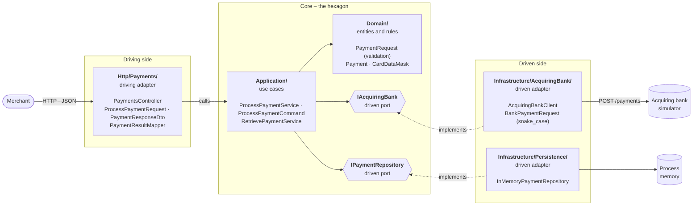

# Payment Gateway

An API that lets a merchant take card payments. It validates each request, sends valid ones
**once** to the acquiring bank (a simulator here), records the bank's decision and returns a safe
summary – never the full card number or CVV. Merchants can retrieve a payment later by its id.

> **Five-minute reviewer path**
> 1. [Quick start](#quick-start) and [API](#api) – what it does.
> 2. [Design decisions](#design-decisions) – why it does it that way.
> 3. The core logic: [`ProcessPaymentService.cs`](src/PaymentGateway.Api/Application/ProcessPayment/ProcessPaymentService.cs)
>    and [`PaymentRequest.cs`](src/PaymentGateway.Api/Domain/PaymentRequests/PaymentRequest.cs).
>
> This README and the code are the source of truth. `specs/` holds process artifacts
> (see [How this was built](#how-this-was-built)) – not required reading.

## Contents

- [Quick start](#quick-start)
- [API](#api)
- [Tests](#tests)
- [Architecture](#architecture)
- [Design decisions](#design-decisions)
- [How this was built](#how-this-was-built)

## Quick start

Requires the [.NET 8 SDK](https://dotnet.microsoft.com/download/dotnet/8.0) and Docker.

```bash
docker compose up -d bank_simulator           # bank simulator on http://localhost:8080
dotnet run --project src/PaymentGateway.Api   # gateway on http://localhost:5067, Swagger at /swagger
```

Or run everything in containers with `docker compose up --build` – the gateway is then on
<http://localhost:8090> (Swagger at `/swagger`).

Then take a payment:

```bash
curl -i -X POST http://localhost:5067/api/payments -H "Content-Type: application/json" -d '{
  "cardNumber": "2222405343248877", "expiryMonth": 12, "expiryYear": 2030,
  "currency": "GBP", "amount": 1050, "cvv": "123"
}'
```

More ready-made requests are in [`PaymentGateway.Api.http`](src/PaymentGateway.Api/PaymentGateway.Api.http).

### Test cards

The [bank simulator](imposters/bank_simulator.ejs) decides by the **last digit** of the card number:

| Last digit | Bank answer | Gateway response |
|---|---|---|
| `1`, `3`, `5`, `7`, `9` | Authorized | `201`, `status: Authorized` |
| `2`, `4`, `6`, `8` | Declined | `201`, `status: Declined` |
| `0` | `503 Service Unavailable` | `503`, `errorCode: bank_unavailable` |

### Configuration

| Setting (env var) | Default | Notes |
|---|---|---|
| `AcquiringBank__BaseUrl` | `http://localhost:8080` | Required; an absolute URL |
| `AcquiringBank__TimeoutSeconds` | `10` | 1–60 |
| `Swagger__Enabled` | `false` (`true` in Development and in compose) | |

Invalid settings stop the gateway at startup.

## API

| Endpoint | Purpose |
|---|---|
| `POST /api/payments` | Process a payment |
| `GET /api/payments/{id}` | Retrieve a processed payment |
| `GET /health` | Liveness probe |

The full contract, with every field documented, is in Swagger.

### Process a payment – `POST /api/payments`

Every request ends in exactly one outcome:

| Outcome | HTTP | `errorCode` | Safe to retry? | What happened |
|---|---|---|---|---|
| **Authorized** / **Declined** | `201` | – | – | The bank decided. The payment is recorded and retrievable at the `Location` header. |
| **Rejected** | `400` | – | Only once fixed | The request was invalid. The bank was **not** called; nothing was recorded. |
| Bank unavailable | `503` | `bank_unavailable` | **Yes** | The bank could not be reached, or turned the request away unprocessed: `503`, `408 Request Timeout` or `429 Too Many Requests`. The payment was not made. |
| Bank error | `502` | `bank_error` | No | The bank refused the request with any other `4xx`. Retrying will fail the same way. |
| Outcome unknown | `504` | `bank_outcome_unknown` | **No** | The request may have reached the bank, but no usable answer came back: a timeout, a lost connection, an unreadable `200`, any `5xx` other than `503`, or an unexpected status such as `201` or `302`. The payment **may have been authorized** – quote the `attemptId` and `traceId` to support. |

Bank failures are errors, not payment statuses: nothing is recorded and they are never reported as
Declined.

A successful response:

```
HTTP/1.1 201 Created
Location: http://localhost:5067/api/payments/3fa85f64-5717-4562-b3fc-2c963f66afa6

{ "id": "3fa85f64-5717-4562-b3fc-2c963f66afa6", "status": "Authorized", "cardNumberLastFour": "8877",
  "expiryMonth": 12, "expiryYear": 2030, "currency": "GBP", "amount": 1050 }
```

There is no merchant-facing idempotency key: a merchant retry is a new payment.

### Retrieve a payment – `GET /api/payments/{id}`

Returns `200` with exactly the fields of the processing response, or `404` when no payment has that
id. An id that is not a GUID gets the framework's own `404` for an unmatched route. Retrieval never
contacts the bank.

### Errors

Every error is a `ProblemDetails` (`application/problem+json`) with a `traceId`.

A **Rejected** payment lists every invalid field at once:

```json
{ "title": "Payment rejected", "status": 400,
  "errors": { "cardNumber": ["Card number must be a string of 14 to 19 digits (0-9)."],
              "currency": ["Currency must be one of: GBP, EUR, USD."] },
  "paymentStatus": "Rejected", "traceId": "4bf92f3577b34da6a3ce929d0e0e4736" }
```

A **bank failure** carries an `errorCode`. Only a `504` also carries an `attemptId`:

```json
{ "title": "Payment could not be confirmed", "status": 504,
  "detail": "The acquiring bank's answer did not arrive or could not be read, so the payment may have been authorized. Do not retry; quote the traceId to support.",
  "errorCode": "bank_outcome_unknown", "attemptId": "3fa85f64-5717-4562-b3fc-2c963f66afa6",
  "traceId": "4bf92f3577b34da6a3ce929d0e0e4736" }
```

The `attemptId` is a handle to quote to support, not a promise that `GET` will find anything –
nothing is recorded for a failed attempt. A `502`/`503` omits it because the payment was certainly
not made, and an id that looks retrievable but 404s would mislead.

### Tracing

Every response carries an `X-Trace-Id` header. It is the same id that appears in the logs, in every
error body (`traceId`) and in the `traceparent` sent to the bank, so one id follows a request end to end.

## Tests

```bash
dotnet test --filter "Category!=E2E"   # unit + integration
dotnet test --filter "Category=E2E"    # against the real simulator (docker compose up -d bank_simulator)
```

| Level | Covers |
|---|---|
| **Unit** | Every validation rule at its boundaries; each use-case outcome (a rejected request never reaches the bank, a valid one reaches it exactly once); masking; the layer dependency rule. |
| **Integration** | The real HTTP pipeline in-process, with the bank replaced by WireMock: every response shape, every bank failure (including timeouts and dropped connections), retrieval, and that no card number or CVV ever reaches a response or a log. |
| **E2E** | Against the real simulator: Authorized, Declined, unavailable (`503`) and refused (`502`) journeys; boundary values that must reach the bank; invalid requests that must not; retrieval, including unknown and malformed ids; and an unreachable bank. The simulator's request count proves each payment reaches the bank exactly once, or not at all. |

A plain `dotnet test` runs all three levels, but each E2E test first probes `localhost:8080` and
**skips itself** (rather than failing) when the simulator is not running – so a clone without Docker
still gets a clean run. CI starts the simulator with `docker compose` and runs all three.

Quality gates, also enforced in CI: `dotnet build -c Release` (warnings are errors) and
`dotnet format --verify-no-changes`.

## Architecture

Hexagonal architecture (ports and adapters) in a single project: the hexagon is expressed as
folders and namespaces. The core – `Domain/` and `Application/` – knows nothing about HTTP, JSON,
ASP.NET Core or the bank's wire format. It declares the **ports** it needs, and **adapters** on
either side plug into them.



Solid arrows are calls; dashed arrows are "implements". Every source-code dependency points
**into** the hexagon: the adapters know the core, the core never knows an adapter. `Program.cs` is
the only composition root – it is the one place that binds each port to its adapter
(`IAcquiringBank` → `AcquiringBankClient`, `IPaymentRepository` → `InMemoryPaymentRepository`).

### The dependency rule, enforced

[`LayerDependencyTests`](test/PaymentGateway.Api.Tests/Unit/Architecture/LayerDependencyTests.cs)
reads every type's signatures and IL and fails the test run (and CI) if a layer reaches outwards or sideways:

| Layer | Hexagon role | Depends on | Never depends on (tested) |
|---|---|---|---|
| `Domain/` | Core: entities, validation rules, card masking | nothing (BCL only) | `Application`, `Http`, `Infrastructure`, any `Microsoft.*` |
| `Application/` | Core: one service per use case, driven ports, results, metrics | `Domain` | `Http`, `Infrastructure`, `Microsoft.AspNetCore` |
| `Http/` | Driving adapter: controller, wire DTOs, result → HTTP mapping | `Application`, `Domain` | `Infrastructure` |
| `Infrastructure/` | Driven adapters: bank HTTP client, in-memory store | `Application` (ports), `Domain` | `Http` |

What this buys:

- **Swappable edges.** A real bank or a database is a new adapter behind the same port; the use
  cases, the domain and their tests do not change.
- **A core tested without I/O.** The use cases run in unit tests against `FakeAcquiringBank` and
  `FakePaymentRepository`; the adapters are tested separately (WireMock for the bank client, the
  real simulator end to end).
- **Each wire format stays in its adapter.** The merchant's JSON contract lives only in `Http/`
  (`ProcessPaymentRequest`, `PaymentResponseDto`); the bank's snake_case contract lives only in
  `Infrastructure/` (`BankPaymentRequest`, `BankPaymentResponse`). The core speaks its own types
  (`ProcessPaymentCommand`, `PaymentRequest`, `Payment`, `BankAuthorizationResult`), so a rename on
  either wire cannot leak into the other.
- **Interfaces only where the core needs the outside world.** The two driven ports are named after
  the capability, not the technology. Use cases are concrete classes: the driving adapter calls
  them directly, since nothing else would implement them.

## Design decisions

### Talking to the bank

- **One bank call, no retries.** A retry could charge the shopper twice.
- **Only `503`, `408` and `429` invite a retry**, because only then did the bank certainly not process
  the payment: it was unavailable, timed out waiting for the request, or was rate-limiting.
  A timeout or a connection lost after sending is a `504`: the outcome is unknown.
- **Redirects are never followed.** Following a `307`/`308` would re-send the card number and CVV to
  whatever host the `Location` header names; any `3xx` is an unknown outcome (`504`).
- **A `200` the gateway cannot read is an unknown outcome**, not a bank error – the bank processed
  it. It is logged at `Error` (the other bank failures log at `Warning`), because it is the one case
  where the shopper may have been charged with nothing to show for it locally.
- **The bank call is never cancelled.** Once sent, the payment happens whether or not the merchant is
  still connected, so the call runs to completion (bounded by the bank timeout) and its outcome is
  recorded.

### Responses and ids

- **`201 Created` for Authorized and Declined.** A processed payment is a new, retrievable resource,
  so it gets a `Location` header; `status` says which of the two it was.
- **Payment ids are random v4 GUIDs, allocated just before the bank call** – not once it answers – so
  a bank-failure log entry can still name the attempt for later reconciliation. Only a `504` returns
  that id (as `attemptId`); see [Errors](#errors).
- **A malformed id is a plain `404`**, produced by ASP.NET Core routing and `UseStatusCodePages` like
  any other unmatched route – not a payment-shaped response.

### Validation

- **All rules live in the domain** (`PaymentRequest.Create`), and every broken rule is reported at once.
  - *Caveat:* if more than one field has the wrong JSON **type** (e.g. `amount` and `expiryMonth` both
    sent as strings), only the first one System.Text.Json hits is reported, because deserialization
    stops there. Every field that deserializes but breaks a **value** rule is still reported together.
- **Values are never trimmed, padded or case-converted into validity**, and numbers must be JSON
  numbers (`"amount": "1050"` is Rejected).
- **The rules:**
  - Card number: 14–19 ASCII digits.
  - Expiry: month 1–12; the card is valid until the end of its expiry month (UTC), and at most
    20 years ahead – a later year is a typing error.
  - Currency: `GBP`, `EUR` or `USD`, exact uppercase.
  - Amount: a whole number of at least 1, in the minor unit (`1050` = 10.50).
  - CVV: 3–4 ASCII digits.
- **An unreadable body** (malformed JSON, a value of the wrong type) is Rejected like any other invalid
  payment, with fixed messages that never echo the submitted value.
- **Every request field is nullable**, so a missing value is Rejected instead of silently defaulting.
- **The use case has its own input type.** The body binds to `Http/Payments/Requests/ProcessPaymentRequest` (the
  wire contract, with Swagger docs), and its `ToCommand()` maps it to
  `Application/ProcessPayment/ProcessPaymentCommand` (raw, possibly missing values) before calling
  `ProcessPaymentService.ProcessAsync`. The shapes match today, but a rename on the wire cannot rename
  the use case's input, and fields are assigned by name, so two `int?` or `string?` values cannot be
  swapped by position. The command is a class, not a record, so its `ToString()` can mask the card
  number and omit the CVV. `PaymentRequest.Create` then validates it inside the use case, against
  the use case's clock. `PaymentResultMapper` converts error field names to camelCase when building
  the response, keeping wire-format concerns out of the domain.

### Card data

- **Only the last four digits are stored or returned.** The full number and CVV exist only while the
  request is handled.
- **Last four, not a masked number.** The assessment's prose mentions a "masked card number", but its
  field table lists the last four digits, so the response follows the table.
- **The bank's authorization code is stored but not returned.** Reconciliation and disputes need it;
  it is not card data, and the assessment's response fields don't include it.

### Logging and metrics

- **Structured JSON logs that never contain card data.**
- **One log entry per request** with its method, matched route template (e.g. `api/payments/{id}`),
  status code and duration – but **not the raw path**, which could hold a pasted card number.
  - The route template comes from an `IHttpLoggingInterceptor` reading `HttpContext.GetEndpoint()`,
    since the built-in `HttpLogging` fields only offer the raw path.
  - For the same reason the framework's hosting logs are off (they put the path in every entry's
    scope). OpenTelemetry's ASP.NET Core and `HttpClient` instrumentation gives each request and bank
    call an `Activity` – and so a trace id – instead.
- **One log entry per bank call**, in `AcquiringBankClient`: `BankCallCompleted` or `BankCallFailed`
  (`Warning`, or `Error` for an unknown outcome), with the payment id, last four, currency and amount.
  Investigating a bank failure never needs joining two entries.
- **A payment the bank decided but the gateway could not store** logs `PaymentNotRecorded` at `Error`,
  with the payment id, status, authorization code, currency and amount, then fails with a `500`. An
  Authorized shopper has been charged with no record to retrieve, so the entry carries what
  reconciliation or a void needs. **Alert on it.**
- **Metrics.** The `PaymentGateway` meter counts `paymentgateway.payments.outcomes` by `result`:
  `authorized`, `declined`, `rejected`, `bank_unavailable`, `bank_error`, `bank_outcome_unknown`.
  **Alert on any `bank_outcome_unknown`.** Request and bank latency come from the built-in
  `http.server.request.duration` and `http.client.request.duration`; the former also counts
  retrievals by route and status (`200` found, `404` not found), so they need no counter of their own.
  Storage has no latency metric: it is in memory.
  - `PaymentMetrics.RecordOutcome` is the single mapping from a result to its tag; bank-failure tags
    reuse `BankFailureKind.ToErrorCode()`, the same string as the response's `errorCode`, so the two
    cannot drift apart.
  - It is called once per request, from `ProcessPaymentService` (every outcome that reaches the use
    case) or `InvalidModelStateResponder` (a model-binding failure that never does).
    `PaymentResultMapper` stays a pure mapper with no metrics side effect.
- **Seeing the metrics locally:**

  ```bash
  dotnet-counters monitor -n PaymentGateway.Api --counters PaymentGateway,Microsoft.AspNetCore.Hosting,System.Net.Http
  ```

### Scope and deployment

- **In-memory storage**, as the assessment allows: payments are lost on restart.
- **No authentication**: any caller holding a payment id can retrieve it.
- **Nothing is exported to an observability backend.** Logs go to the console; metrics are read with
  `dotnet-counters`. OpenTelemetry is used only to give every request a trace id. Exporting traces
  and metrics to a collector (OTLP) is a production next step.
- **TLS is terminated upstream.** The gateway serves HTTP and never redirects to HTTPS – redirecting
  after a card number was already sent in clear protects nothing.
- **Ubuntu Chiseled runtime image** (`aspnet:8.0-noble-chiseled`), running as non-root: no shell, no
  package manager, nothing beyond the ASP.NET Core runtime.
- **`/health` is liveness only.** A readiness probe that also called the bank was rejected: it would
  let a slow bank take the gateway out of rotation, turning a bank outage into merchants losing even
  their validation (Rejected) responses.

## How this was built

Spec-first and test-first with [Spec Kit](https://github.com/github/spec-kit), with one folder per
use case in [`specs/`](specs/).
These are process artifacts, not required reading: this README and the code are current, and
[`specs/README.md`](specs/README.md) lists what changed since the specs were written.
