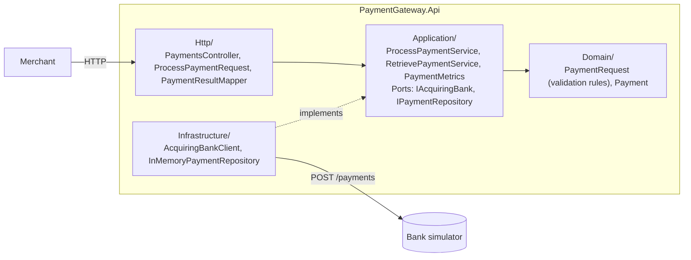

# Payment Gateway

An API that lets a merchant take card payments. It validates each request, sends valid ones
**once** to the acquiring bank (a simulator here), records the bank's decision and returns a safe
summary – never the full card number or CVV. Merchants can retrieve a payment later by its id.

Built for the Checkout.com take-home assessment ([requirements](docs/requirements/assessment.md)).

**Five-minute reviewer path:** this README is the current source of truth. Read [API](#api) and
[Design decisions](#design-decisions) below, then [`ProcessPaymentService.cs`](src/PaymentGateway.Api/Application/ProcessPayment/ProcessPaymentService.cs)
and [`PaymentRequest.cs`](src/PaymentGateway.Api/Domain/PaymentRequests/PaymentRequest.cs) for the
core logic. `specs/` and `.specify/` are process artifacts from building this test-first with Spec
Kit (see [How this was built](#how-this-was-built)) – not required reading.

## API

`POST /api/payments` ends in exactly one outcome:

| Outcome | HTTP | Meaning |
|---|---|---|
| **Authorized** / **Declined** | `201` | the bank decided; the payment is recorded and retrievable at the `Location` header |
| **Rejected** | `400` | invalid information; the bank was **not** called, nothing recorded |
| Bank unavailable | `503` | the bank answered `503` or could not be reached – the payment was not made; retrying is safe |
| Bank error | `502` | the bank answered with a `4xx`, refusing the request outright; retrying will not help |
| Outcome unknown | `504` | the request may have reached the bank but no usable response came back – a timeout, a lost connection, an unreadable `200`, or **any `5xx` other than `503`** (the bank's own or a proxy's in front of it, which can happen after an authorization was already committed); the payment may have been authorized, so do not retry – quote the `attemptId` to support |

Bank failures are errors, not payment statuses: nothing is recorded and they are never reported as Declined.
Why `504` cannot be avoided without the bank's help, and how production closes it, is under
[Unknown outcomes and double charges](#unknown-outcomes-and-double-charges).

There is no merchant-facing idempotency key: a merchant retry is a new payment. Why that is a
deliberate scope decision, and not an oversight, is under
[Unknown outcomes and double charges](#unknown-outcomes-and-double-charges).

`GET /api/payments/{id}` returns the payment with exactly the fields of the processing response, or
`404` when no payment has that id. An id that is not a GUID never reaches the use case either: it gets
the framework's own `404` for an unmatched route. It never contacts the bank.

```bash
curl -i -X POST https://localhost:7092/api/payments -H "Content-Type: application/json" -d '{
  "cardNumber": "2222405343248877", "expiryMonth": 12, "expiryYear": 2030,
  "currency": "GBP", "amount": 1050, "cvv": "123"
}'
```

```
HTTP/1.1 201 Created
Location: https://localhost:7092/api/payments/3fa85f64-5717-4562-b3fc-2c963f66afa6

{ "id": "3fa85f64-5717-4562-b3fc-2c963f66afa6", "status": "Authorized", "cardNumberLastFour": "8877",
  "expiryMonth": 12, "expiryYear": 2030, "currency": "GBP", "amount": 1050 }
```

Every response carries its trace id in an `X-Trace-Id` header – the same id that is in the logs, in
every error body (`traceId`) and in the `traceparent` sent to the bank. Every error is a
`ProblemDetails`. A Rejected payment lists every invalid field:

```json
{ "type": "https://tools.ietf.org/html/rfc9110#section-15.5.1", "title": "Payment rejected", "status": 400,
  "errors": { "cardNumber": ["Card number must be a string of 14 to 19 digits (0-9)."],
              "currency": ["Currency must be one of: GBP, EUR, USD."] },
  "paymentStatus": "Rejected", "traceId": "4bf92f3577b34da6a3ce929d0e0e4736" }
```

Bank failures carry an `errorCode` (`bank_unavailable`, `bank_error` or `bank_outcome_unknown`). Only a
`504` also carries an `attemptId`: for a `502`/`503` the payment was certainly not made, so an id that
looks retrievable (and 404s on `GET`) would mislead; a `504`'s outcome is genuinely unknown, so the id
is a handle to quote to support, not a claim that `GET` will find anything.

```json
{ "type": "https://tools.ietf.org/html/rfc9110#section-15.6.4", "title": "Payment could not be confirmed",
  "status": 504, "detail": "The acquiring bank's answer did not arrive or could not be read, so the payment may have been authorized. Do not retry; quote the traceId to support.",
  "errorCode": "bank_outcome_unknown", "attemptId": "3fa85f64-5717-4562-b3fc-2c963f66afa6",
  "traceId": "4bf92f3577b34da6a3ce929d0e0e4736" }
```

More requests are in [`PaymentGateway.Api.http`](src/PaymentGateway.Api/PaymentGateway.Api.http);
the full contract is in Swagger.

## Run

Requires the .NET 8 SDK and Docker.

```bash
docker compose up -d bank_simulator           # simulator on http://localhost:8080
dotnet run --project src/PaymentGateway.Api   # gateway on https://localhost:7092, Swagger at /swagger
```

Or everything in containers: `docker compose up --build` (gateway on <http://localhost:8090>).

| Setting (env var) | Default | |
|---|---|---|
| `AcquiringBank__BaseUrl` | `http://localhost:8080` | required, absolute URL |
| `AcquiringBank__TimeoutSeconds` | `10` | 1–60 |
| `Swagger__Enabled` | `false` (Development and compose: `true`) | |
| `OTEL_EXPORTER_OTLP_ENDPOINT` | unset | when set, traces and metrics are exported there (OTLP) |

Invalid settings stop the gateway at startup.

## Tests

```bash
dotnet test --filter "Category!=E2E"   # unit + integration
dotnet test --filter "Category=E2E"    # against the real simulator (docker compose up -d bank_simulator)
```

- **Unit** – every validation rule at its boundaries, each use-case outcome (a rejected request
  never reaches the bank; a valid one reaches it exactly once), masking, and the layer rule.
- **Integration** – the real HTTP pipeline in-process with the bank replaced by WireMock: every
  response shape, every bank failure (including timeouts and dropped connections), retrieval, and
  that no card number or CVV reaches a response or a log.
- **E2E** – Authorized, Declined and unavailable journeys against the real simulator.

CI runs all three levels: it starts the simulator with `docker compose` for the E2E tests. A plain
`dotnet test` includes E2E too, but each E2E test probes `localhost:8080` first and skips itself
(rather than failing) when the simulator is not running, so a clone without Docker still gets a
clean run.

Quality gates: `dotnet build -c Release` (warnings are errors) and `dotnet format --verify-no-changes`.

## Architecture

One project, hexagonal folders; dependencies point inwards only, enforced by an architecture test.



## Design decisions

**Payments**
- **One bank call, no retries** – a retry could charge the shopper twice.
- **Only `503` invites a retry**, because only then did the bank certainly not process the payment.
  A timeout or a connection lost after sending is `504`: the outcome is unknown (see
  [Unknown outcomes and double charges](#unknown-outcomes-and-double-charges)).
- **No merchant-facing idempotency key.** The assessment marks it optional, and a gateway-only key
  (in-memory, lost on restart, per process) protects nothing a production deployment could rely on:
  see [Unknown outcomes and double charges](#unknown-outcomes-and-double-charges) for what actually
  closes the double-charge gap, and why it needs the bank's support regardless of what the gateway does.
- **A `200` the gateway cannot read is an unknown outcome**, not a bank error: the bank processed it.
  It is logged at `Error` (not `Warning`, unlike the other two bank failure kinds), because it is the
  one case where the shopper may have been charged with nothing to show for it locally.
- **No cancellation of the bank call** – once sent, the payment happens whether or not the merchant
  is still connected, so the call runs to completion (bounded by the bank timeout) and its outcome
  is recorded. Retrieval does stop when the merchant disconnects.
- **`201` for Authorized and Declined** – a processed payment is a new, retrievable resource, so it
  is `Created` with a `Location` header pointing at it; `status` still carries which of the two it was.
- **Payment ids** are random v4 GUIDs, allocated right before the bank call (not only once it
  answers), so a bank-failure log entry can still name the attempt for later reconciliation even
  though nothing is stored under that id when the bank never decided. Only a `504` body returns it (as
  `attemptId`): a `502`/`503` means the payment was certainly not made, so returning an id that looks
  retrievable, and isn't, would be misleading.
- **A malformed id (not a GUID) is a plain `404`**, produced by ASP.NET Core's own routing and
  `UseStatusCodePages`, the same as any other unmatched route – not a payment-shaped response.

**Validation**
- All rules live in the domain (`PaymentRequest.Create`) and every broken rule is reported at once –
  with one caveat: if the body has more than one field of the wrong JSON *type* (e.g. `amount` and
  `expiryMonth` both sent as strings), only the first one System.Text.Json's reader hits is reported,
  because deserialization itself stops there. Every field that deserializes but fails a *value* rule
  (out of range, wrong length, unsupported currency, …) is still reported together, in one response.
- Values are never trimmed, padded or case-converted into validity, and numbers must be JSON numbers
  (`"amount": "1050"` is Rejected). Currencies are `GBP`, `EUR`, `USD`, exact uppercase. Amount is at
  least 1. A card is valid until the end of its expiry month (UTC), and expires at most 20 years
  ahead – a later year is a typing error.
- A body that cannot be read (malformed JSON, a value of the wrong type) is Rejected like any other
  invalid payment, with fixed messages that never echo the submitted value.
- The body binds to `Http/Payments/ProcessPaymentRequest` (the wire contract, with Swagger docs); the
  controller passes its fields straight to `ProcessPaymentService.ProcessAsync`, which has no input
  type of its own – a use case with one caller and no other adapter doesn't need a second copy of the
  same six fields just in case one side is renamed. Every field is nullable so a missing value is
  Rejected instead of silently defaulting. `PaymentResultMapper` converts a validation error's field
  name to camelCase once, when building the response, so the domain stays free of any wire-format
  concern.

**Card data and logs**
- Only the last four digits are stored or returned; the CVV and full number exist only while the
  request is handled. The bank's authorization code is stored for reconciliation and disputes, but
  not returned: it is not card data, and the assessment's response fields do not include it. The assessment's prose mentions a "masked card number", but its field table
  lists the last four digits, so the response follows the table.
- Logs are structured JSON and never contain card data.
- Every request is logged once with its method, matched route template (e.g. `api/payments/{id}`),
  status code and duration – but not its raw path, which may hold a pasted card number. The route
  comes from an `IHttpLoggingInterceptor` reading `HttpContext.GetEndpoint()`, added because the
  built-in `HttpLogging` fields only offer the raw path. For the same reason the framework's hosting
  logs stay off (they put the path in the scope of every entry); OpenTelemetry's ASP.NET Core and
  `HttpClient` instrumentation (`AddOpenTelemetry().WithTracing(...)`) is what gives each request and
  bank call an `Activity`, hence a trace id, in place of the raw path.
- Every bank call is logged once, in `AcquiringBankClient` (`BankCallCompleted`, or `BankCallFailed` –
  `Warning`, or `Error` for an unknown outcome), with the payment id, last four, currency and amount, so
  a bank failure never needs joining two log entries to find the payment it belongs to.
- Metrics: the `PaymentGateway` meter counts `paymentgateway.payments.outcomes` by `result`
  (`authorized`, `declined`, `rejected`, `bank_unavailable`, `bank_error`, `bank_outcome_unknown`) –
  alert on any `bank_outcome_unknown` – next to the built-in `http.server.request.duration` and
  `http.client.request.duration` (bank latency). One method, `PaymentMetrics.RecordOutcome(ProcessPaymentResult)`,
  is the single mapping from a result to its tag (a bank-failure tag reuses `BankFailureKind.ToErrorCode()`,
  the same string the `errorCode` uses). It's called from two places, each counting once per request:
  `ProcessPaymentService`, for every outcome that reaches the use case; `InvalidModelStateResponder`,
  for a framework model-binding failure that never reaches it. `PaymentResultMapper` stays a pure
  result-to-HTTP-response mapper with no metrics side effect.
- An OTLP exporter for both is registered only when `OTEL_EXPORTER_OTLP_ENDPOINT` is set, so a
  deployment without a collector configured doesn't spend every export cycle failing to reach
  `http://localhost:4317`. Locally, without that variable, `dotnet-counters monitor -n
  PaymentGateway.Api --counters PaymentGateway,Microsoft.AspNetCore.Hosting,System.Net.Http` still
  shows the counters.

**Scope**
- Storage is in memory, as the assessment allows: payments are lost on restart.
- No authentication: any caller holding a payment id can retrieve it.
- TLS is expected to be terminated upstream; the gateway serves HTTP and never redirects to HTTPS.
- The runtime image is Ubuntu Chiseled (`aspnet:8.0-noble-chiseled`): no shell, no package manager,
  nothing beyond the ASP.NET Core runtime. `/health` is for the orchestrator's HTTP probe – liveness
  only. A readiness probe that also called the acquiring bank was considered and rejected: it would
  let a slow or unhealthy bank take the gateway itself out of rotation, cascading a bank outage into
  merchants losing even a Rejected/validation response.

## Unknown outcomes and double charges

**Why `504` exists.** When the request reaches the bank and its answer is lost (timeout, dropped
connection, an unreadable `200`), no gateway can tell "never arrived" from "authorized, reply lost".
Exactly-once over a network is impossible; payment systems get *effectively once* by letting the
sender repeat and making every receiver discard duplicates. This path has two hops, and only the
first discards duplicates today:

| Hop | Duplicates discarded? |
|---|---|
| Merchant → gateway | No – no `Idempotency-Key`; see below for why one wasn't built |
| Gateway → bank | No – the simulator treats every `POST /payments` as a new charge and has no way to cancel or look up an attempt |

So `504` is the honest answer: the gateway records nothing, logs the attempt at `Error` with its
payment id, last four, amount and trace id, and tells the merchant not to retry.

**A third way to lose the record: the write after authorization can itself fail.** If
`IPaymentRepository.AddAsync` throws after the bank already authorized (`ProcessPaymentService.AuthorizeAsync`),
the shopper is charged, nothing is stored, and the merchant gets an unhandled `500` with no `attemptId` to
quote – worse than a `504`, which at least names the attempt. This can't happen against today's in-memory
store, but it becomes the most important failure mode the moment a real database is introduced. *Fix:*
write a `Pending` payment *before* the bank call (not after), so a write failure happens before the shopper
is charged instead of after, and a crash between the two leaves a `Pending` row a recovery job can resolve
against the bank instead of a charge with no record at all.

**Why no merchant-facing `Idempotency-Key`.** The assessment marks it optional, and a gateway-only
key is weak protection: it would need to be in-memory (this gateway keeps no other durable state),
so it is lost on restart and not shared across instances – exactly when a merchant is most likely to
retry. Closing the gap for real needs the bank-side step below regardless, at which point a
gateway-side key adds complexity without moving the needle on the two failure modes that matter:

- **The merchant retries without any correlation** after losing a `201` on their side – the gateway
  cannot tell it is the same payment. *Fix:* an `Idempotency-Key` header, but durable and shared
  across instances (see below), not the in-memory version that would only mask the gap.
- **The merchant retries a `504`** – the bank-side step below resolves this by making the *bank*
  idempotent, so any retry (with or without a gateway-side key) reaches it as the same request.

**What resolves it in production – deliberately not built here.** Both need the acquiring bank's
support, which the provided simulator lacks; building them would mean writing that support into the
simulator ourselves, so the tests would only prove the gateway works against a bank we wrote to fit it.

- **Bank-side idempotency.** Send a `reference` derived from the merchant and payment (e.g. a UUIDv5
  of a durable, shared `Idempotency-Key`), so every retry of one payment – from any instance, after
  any restart – reaches the bank as the *same* request, and the bank answers a repeat with the
  original result. On an unknown outcome the gateway can then safely re-send and get the real
  Authorized/Declined.
- **Timeout reversal**, the card networks' fallback: if the bank still cannot answer, send a reversal
  for that reference so the payment is certainly not made and the merchant gets a definite "retry is
  safe". The bank must refuse a late authorization for a reversed reference.

## Not built (production next steps)

Merchant authentication, with retrieval and a durable, shared `Idempotency-Key` scoped per merchant
(see [above](#unknown-outcomes-and-double-charges) for why an in-memory, per-process version wasn't
built instead); bank-side idempotency and timeout reversals (also above); persistent storage; PCI DSS
scope reduction (tokenisation); a circuit breaker around the bank; an actually-configured OTLP
collector (the exporter is wired and opt-in via `OTEL_EXPORTER_OTLP_ENDPOINT`, but nothing is
deployed to receive it today); a reconciliation path for a `504` – today a retry just gets a fresh
`504`, and `GET` can never find the `attemptId` since nothing was recorded; a `Pending`/`Unknown`
payment status that `GET` could return would close that gap.

**Versioning** – not built, and no versioning scheme is exposed today. With more time this would be
an additive-only contract (new optional fields, new enum values merchants must tolerate) for as long
as possible, and a breaking change would go behind a URL segment (`/api/v2/payments`) so existing
integrations keep working on `/api/payments` unchanged.

## How this was built

Spec-first and test-first with Spec Kit, governed by the project
[constitution](.specify/memory/constitution.md): one folder per use case in [`specs/`](specs/). These
are process artifacts, not required reading – this README and the code are current, and
[`specs/README.md`](specs/README.md) lists what changed since the specs were written.
