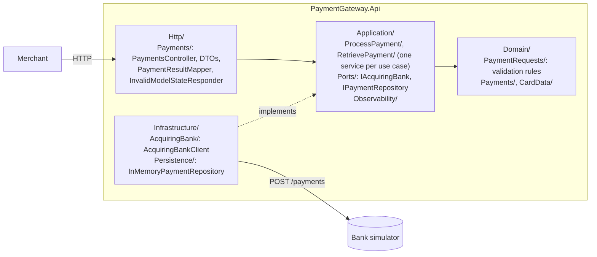
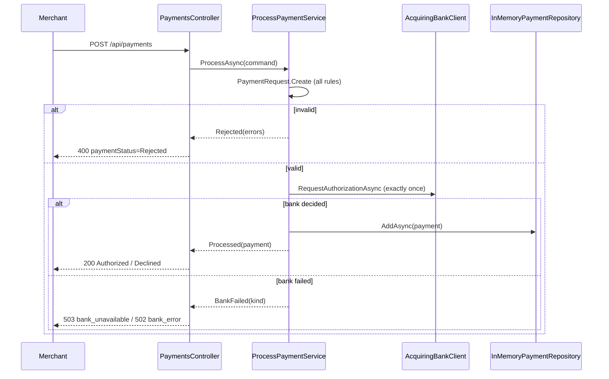
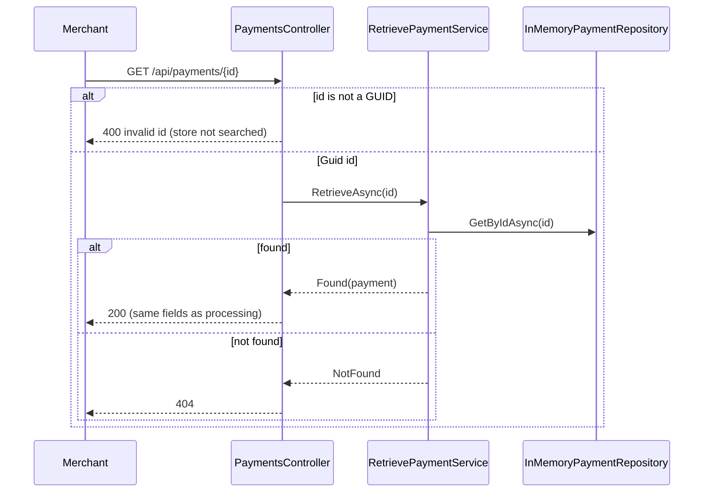

# Payment Gateway

An API-based payment gateway that lets a merchant take card payments from its shoppers. It
validates each payment request, forwards valid ones **once** to the acquiring bank (a simulator
here), records the bank's decision and returns a safe summary – never the full card number or CVV.
Merchants can also retrieve any Authorized or Declined payment later by its id, for reconciliation.

Built for the Checkout.com take-home assessment ([requirements](docs/requirements/assessment.md)).

## 1. Overview

`POST /api/payments` ends in exactly one outcome:

| Outcome | HTTP | Meaning |
|---|---|---|
| **Authorized** | `200` | the bank authorized the payment; it is recorded |
| **Declined** | `200` | the bank declined the payment; it is recorded |
| **Rejected** | `400` | invalid information was supplied; the bank was **not** called and nothing was recorded |
| Bank unavailable | `503` | the bank is unavailable or did not answer in time; nothing recorded – try again later |
| Bank error | `502` | the bank refused the request or answered unreadably; nothing recorded – retrying will not help |

Bank failures are errors, not payment statuses: they are never reported as Declined.

`GET /api/payments/{id}` retrieves a previously Authorized or Declined payment by the id returned
when it was processed, with exactly the same fields:

| Outcome | HTTP | Meaning |
|---|---|---|
| **Found** | `200` | the payment, identical to the processing response |
| **Not found** | `404` | no Authorized or Declined payment has this id |
| **Invalid id** | `400` | the id is not a GUID in any accepted form; the store is not searched |

Retrieval has no side effects and never contacts the acquiring bank.

## 2. Run locally

Requires the .NET 8 SDK and Docker (for the bank simulator).

```bash
docker compose up -d bank_simulator              # simulator on http://localhost:8080
dotnet run --project src/PaymentGateway.Api      # gateway on https://localhost:7092 (http://localhost:5067 redirects)
```

- HTTPS needs the ASP.NET Core developer certificate once: `dotnet dev-certs https --trust`.
- Swagger UI: <https://localhost:7092/swagger> (enabled by `Swagger:Enabled=true` in
  `appsettings.Development.json`)
- Health: `curl https://localhost:7092/health` → `200 Healthy`

## 3. Run with Docker

```bash
docker compose up --build
```

| Service | URL | Notes |
|---|---|---|
| `payment_gateway` | <http://localhost:8090> | Swagger at `/swagger`; runs as a non-root user |
| `bank_simulator` | <http://localhost:8080> (Mountebank admin on 2525) | unchanged from the template |

Configuration (environment variables, bound through the Options pattern and validated at startup):

| Variable | Default | Meaning |
|---|---|---|
| `AcquiringBank__BaseUrl` | `http://localhost:8080` (compose: `http://bank_simulator:8080`) | bank URL – required, absolute |
| `AcquiringBank__TimeoutSeconds` | `10` | bank call timeout, 1–60 |
| `Swagger__Enabled` | `false` (compose: `true`) | serve Swagger UI and the OpenAPI document |

An invalid value stops the gateway at startup with an options validation error.

## 4. Test commands

```bash
# Unit – domain rules and the use case, with hand-written fakes
dotnet test --filter "FullyQualifiedName~PaymentGateway.Api.Tests.Unit"

# Integration – the real pipeline and adapters in-process; the bank is WireMock
dotnet test --filter "FullyQualifiedName~PaymentGateway.Api.Tests.Integration"

# Default run (unit + integration; E2E excluded) with coverage – what CI runs
dotnet test --filter "Category!=E2E" --collect:"XPlat Code Coverage" --results-directory ./coverage

# End-to-end – against the real simulator
docker compose up -d bank_simulator
dotnet test --filter "Category=E2E"
```

Coverage is written as Cobertura XML under `coverage/<run-id>/coverage.cobertura.xml`. It is
reported, not enforced.

Quality gates: `dotnet build -c Release` (warnings are errors) and
`dotnet format --verify-no-changes`.

## 5. Test strategy

Every behaviour was driven test-first (Red → Green → Refactor). Tests are named
`<Unit>_<Scenario>_<ExpectedBehaviour>` and follow Arrange / Act / Assert.

| Level | What it uses | What it proves | Risks it covers |
|---|---|---|---|
| **Unit** (`test/…/Unit`) | domain types and `ProcessPaymentService` with hand-written fakes; fixed clock (`FakeTimeProvider`); `FakeLogger`; `MetricCollector` | every validation rule at its boundaries (`[Theory]`: card 13/14/19/20 digits, non-ASCII digits, CVV 2/3/4/5, month 0/1/12/13, year last/this/9999/10000, current vs previous month, amount 0/1, currency `GBP`/`gbp`/`JPY`); no trimming or coercion; all errors reported together; each use-case outcome; a rejected request never reaches the bank; a valid one reaches it exactly once; outcome logs and counter; masked `ToString()` on every type carrying card data | validation boundaries; card data leakage; a rejected payment reaching the bank |
| **Integration** (`test/…/Integration`) | `WebApplicationFactory<Program>` – real HTTP pipeline, real bank adapter and repository; only the bank is replaced, by WireMock | `200` Authorized/Declined; `400` Rejected (rules and unreadable bodies); `502`/`503` for every bank failure (400, 503, other status, unreadable or incomplete body, timeout, connection refused) with a single call; error shape and `traceId` (including routing `404`/`405`); `traceId` equals the log entry's `TraceId`; no card number or CVV in any response or log, including a card number sent in a request **path** or **body**; startup validation; `/health`; the OpenAPI document and the Swagger flag; **retrieval** (`GET /api/payments/{id}`) – a `GET` after `POST` returns a body **equal** to the `POST` body; every accepted GUID notation (canonical, without hyphens, in braces, in parentheses, uppercase, surrounding whitespace) finds the same payment; repeated `GET`s are identical; **no** request reaches WireMock during `GET`; an unknown or all-zeros id returns `404` with a `traceId` correlated to the log; a malformed id (including a card-like value) returns `400` naming `id` with a fixed message, never `404`; the empty-id route returns `405` | a bank failure misreported as Declined; drift in the bank contract; card data leakage through framework logging; inconsistent errors; misconfiguration; a malformed retrieval id answered as "not found"; drift between the processing and retrieval representations of a payment |
| **E2E** (`test/…/EndToEnd`, `Category=E2E`) | the gateway in-process against the real simulator, real clock and logging | Authorized, Declined and Bank unavailable journeys; **process then retrieve** for an Authorized and a Declined payment | drift between our bank contract and the real simulator |

Guard tests that passed on first run (because an earlier step already delivered the behaviour)
were each shown to fail by temporarily breaking the behaviour.

## 6. Architecture

One production project with the hexagon expressed as folders: dependencies point inwards only.
Inside each layer, files are grouped by role (use case, domain concept, adapter, API resource),
never by kind (`Services/`, `Repositories/`, …), so a new feature adds a folder instead of
growing every existing one; architecture tests enforce both rules.







## 7. API usage

Requests are also in [`src/PaymentGateway.Api/PaymentGateway.Api.http`](src/PaymentGateway.Api/PaymentGateway.Api.http);
the full contract is in Swagger (`/swagger`).

```bash
curl -i -X POST https://localhost:7092/api/payments -H "Content-Type: application/json" -d '{
  "cardNumber": "2222405343248877", "expiryMonth": 12, "expiryYear": 2030,
  "currency": "GBP", "amount": 1050, "cvv": "123"
}'
```

`200 OK`

```json
{ "id": "3fa85f64-5717-4562-b3fc-2c963f66afa6", "status": "Authorized", "cardNumberLastFour": "8877",
  "expiryMonth": 12, "expiryYear": 2030, "currency": "GBP", "amount": 1050 }
```

`400 Bad Request` (card `1234`, currency `gbp`, amount `0`)

```json
{ "type": "https://tools.ietf.org/html/rfc9110#section-15.5.1", "title": "Payment rejected", "status": 400,
  "errors": { "cardNumber": ["Card number must be 14 to 19 characters long and contain only digits 0-9."],
              "currency": ["Currency must be one of: GBP, EUR, USD."],
              "amount": ["Amount must be an integer in the minor currency unit of at least 1."] },
  "paymentStatus": "Rejected", "traceId": "4bf92f3577b34da6a3ce929d0e0e4736" }
```

`503 Service Unavailable` (card ending in `0`) – `502 Bad Gateway` has the same shape with `bank_error`

```json
{ "type": "https://tools.ietf.org/html/rfc9110#section-15.6.4", "title": "Payment could not be processed",
  "status": 503, "detail": "The acquiring bank is unavailable. Try again later.",
  "errorCode": "bank_unavailable", "traceId": "4bf92f3577b34da6a3ce929d0e0e4736" }
```

Amounts are integers in the minor currency unit (USD $10.50 = `1050`). JSON is camelCase; card
number, CVV and last four digits are strings so leading zeros are kept.

```bash
curl -i https://localhost:7092/api/payments/3fa85f64-5717-4562-b3fc-2c963f66afa6
```

`200 OK` – exactly the fields and values of the processing response for that payment.

`404 Not Found` (a well-formed but unissued id)

```json
{ "type": "https://tools.ietf.org/html/rfc9110#section-15.5.5", "title": "Payment not found",
  "status": 404, "detail": "No payment exists with the given id.",
  "traceId": "4bf92f3577b34da6a3ce929d0e0e4736" }
```

`400 Bad Request` (`GET /api/payments/abc`) – note there is **no** `paymentStatus`, unlike the
processing `400`, because no payment was attempted

```json
{ "type": "https://tools.ietf.org/html/rfc9110#section-15.5.1", "title": "Invalid payment id", "status": 400,
  "errors": { "id": ["The payment id must be a GUID, e.g. 3fa85f64-5717-4562-b3fc-2c963f66afa6."] },
  "traceId": "4bf92f3577b34da6a3ce929d0e0e4736" }
```

Any GUID notation the platform parses is accepted for `{id}` – canonical, without hyphens, in
braces, in parentheses – in any letter case, with surrounding whitespace ignored; the response
always returns `id` in canonical lowercase form.

## 8. Observability

**Logs** – JSON lines on the console with scopes, so every entry of a request carries its `TraceId`.
The same id is the `traceId` of every error response: quote it to find the request in the logs.

| EventId | Event | Level | Fields |
|---|---|---|---|
| 1000 | `PaymentProcessed` | Information | `paymentId`, `status`, `currency`, `amount` |
| 1001 | `PaymentRejected` | Information | `invalidFields` (field names only) |
| 1002 | `PaymentBankFailed` | Warning | `failureKind`, `currency`, `amount` |
| 1003 | `PaymentRequestUnreadable` | Information | `invalidFields` (binding paths only, e.g. `$.amount`) |
| 2000 | `BankCallCompleted` | Information | `durationMs`, `outcome` |
| 2001 | `BankCallFailed` | Warning | `durationMs`, `failureKind`, `httpStatusCode` |
| 3000 | `PaymentRetrieved` | Information | `paymentId`, `status` |
| 3001 | `PaymentNotFound` | Information | `paymentId` (the parsed GUID) |
| 3002 | `PaymentIdInvalid` | Information | – (the raw submitted value is never logged) |

No entry ever contains a card number, CVV or submitted value. There is no retrieval metric: every
retrieval outcome is traceable by `traceId` through the logs alone (Constitution Principle XI
requires none for a read-only operation with no failure modes of its own). Framework request logging is off:
HTTP logging is not enabled, `Microsoft.AspNetCore` and `System.Net.Http.HttpClient` stay at
`Warning`, and `Microsoft.AspNetCore.Hosting.Diagnostics` is `None` – its request scope would
otherwise print the request path, which may hold a pasted card number, on every entry. Because
that category is off, the gateway registers an `ActivitySource` listener so each request still
gets a trace id.

**Metrics** – meter `PaymentGateway`:

| Instrument | Tags |
|---|---|
| `paymentgateway.payments.outcomes` (counter) | `result` = `authorized` \| `declined` \| `rejected` \| `bank_unavailable` \| `bank_error` |
| `paymentgateway.bank.request.duration` (histogram, s) | `outcome` |

`rejected` counts requests that reached the use case. Unreadable bodies are not counted there; they
appear as `400` on route `api/payments` in the built-in `http.server.request.duration`
(meter `Microsoft.AspNetCore.Hosting`), which also gives request latency percentiles.

```bash
dotnet tool install -g dotnet-counters
dotnet-counters monitor -n PaymentGateway.Api --counters PaymentGateway,Microsoft.AspNetCore.Hosting
```

**Health** – `GET /health` is a liveness check; it does not call the bank, so a bank outage does
not make the gateway look dead.

## 9. Design decisions and assumptions

- **`200` for Authorized and Declined**, no `Location` header: the outcome is in `status`, as the
  bank answers `200` for both; the `id` is used to retrieve the payment.
- **Rejected = `400` `ProblemDetails`** listing every invalid field, with `paymentStatus: "Rejected"`.
  `paymentStatus` appears only on `400` responses of `POST /api/payments`.
- **Every error is a `ProblemDetails` with `traceId`**, including routing errors (`404`, `405`).
- **`503` vs `502`**: bank unavailable or timeout (try later) vs bank error (retrying will not help).
  Timeouts count as unavailable.
- **No retries**: a payment request is not idempotent; retrying could charge a shopper twice.
- **Expiry**: a card is valid until the end of its expiry month, in UTC; years above 9999 are Rejected.
- **Currencies**: `GBP`, `EUR`, `USD`, exact uppercase codes. **Amount** must be at least 1.
- **No coercion**: values are never trimmed, padded or case-converted into validity.
- **Unreadable bodies** get fixed messages that never echo the submitted value.
- **Field rules in the OpenAPI document** come from `PaymentRuleSchemaFilter`, a Swagger schema
  filter that copies each `PostPaymentRequest` property's description from `PaymentRequest.Messages`
  instead of repeating the rule text in per-property XML comments: the rules live in the domain, and
  validation attributes (or duplicated rule text) on the HTTP type would let the document and a
  Rejected response drift apart.
- **Payment ids** are random v4 GUIDs, so they are unique and not guessable.
- **Storage** is in memory, as the assessment allows: payments are lost on restart. Concurrency safety
  comes from an immutable `Payment` in a `ConcurrentDictionary`; there is no stress test.
- **Single project** with hexagonal folders (`Domain`, `Application`, `Infrastructure`, `Http`).
- **TLS is terminated upstream**: the container listens on HTTP only, so `UseHttpsRedirection()` finds
  no HTTPS port there and serves HTTP. Locally the launch profile adds `https://localhost:7092` and HTTP
  requests are redirected (`307`). A redirect does not protect a `POST`: its card data has already
  crossed plain HTTP, so clients must call the HTTPS address directly.
- **Swagger is enabled by a flag**, never by the Development environment (which would also enable the
  developer exception page).
- **Latency (95 % under 2 s)** is checked manually with `curl -w "%{time_total}"`, and observed in
  production through `http.server.request.duration`; there is no load test.
- **Retrieval accepts every GUID notation** the platform parses – canonical, without hyphens, in
  braces, in parentheses – case-insensitively, with surrounding whitespace ignored: the route
  parameter is bound as a plain `Guid` with **no `:guid` route constraint**, so a malformed id is
  matched by the action (and answered `400` naming `id`) rather than becoming an unmatched route
  (which would be an indistinguishable `404`).
- **Malformed retrieval id is `400`, never `404`**, and carries no `paymentStatus` (unlike the
  processing `400`), because no payment was attempted; the fixed message never echoes the
  submitted value, since it may be a pasted card number.
- **Empty id is `405`**: `GET /api/payments` and `GET /api/payments/` match only the `POST` route,
  so routing answers `405 Method Not Allowed` (via the same `UseStatusCodePages()` as every other
  routing error) – never a payment, a list or an unexpected error.
- **One payment representation**: retrieval reuses UC1's `PaymentResponse` and mapping unchanged,
  so the retrieved payment equals the processing response by construction – nothing to keep in
  sync by hand.
- **Last four digits, not a "masked card number"**: the assessment's prose mentions a masked card
  number, but its field table lists only the last four digits; the response follows the table.
- **No ownership check**: any caller holding a payment's id can retrieve it (Constitution
  Principle I – authentication is out of scope). Random, non-guessable ids (v4 GUIDs) limit
  enumeration; merchant-scoped access and enumeration monitoring are production next steps.
- **No retrieval metric**: every outcome is logged with the request's `traceId`; a counter would
  add nothing a log query does not already give for a read-only operation.
- **Retrieval never contacts the bank and has no side effects**: `RetrievePaymentService` has no
  `IAcquiringBank` dependency, so it cannot call it even by mistake.
- **Restart loses retrievability**: payments live only in the in-memory store (Constitution
  Technical Constraints), so any payment recorded before a restart is "not found" afterwards –
  same trade-off as UC1's storage, not a new one.

## 10. Production next steps (not built)

Idempotency keys; merchant authentication; persistent storage; PCI DSS scope reduction (e.g.
tokenisation); a circuit breaker around the bank; OpenTelemetry exporters for logs, metrics and
traces; merchant-scoped access to retrieved payments; monitoring for payment-id enumeration.

## How this was built

With Spec Kit, spec-first and test-first: the constitution in
[`.specify/memory/constitution.md`](.specify/memory/constitution.md) and one folder per use case in
[`specs/`](specs/) – spec, plan, research, data model, contract, quickstart and tasks.
